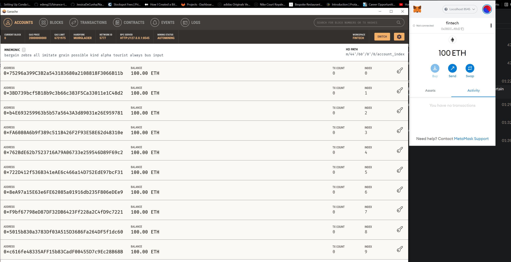
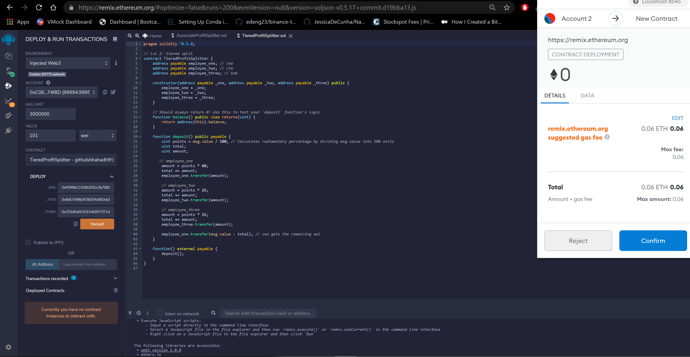
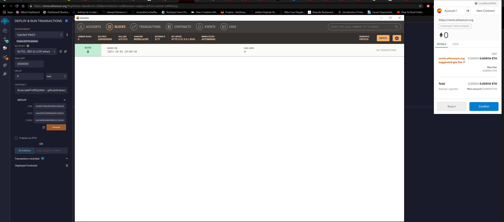
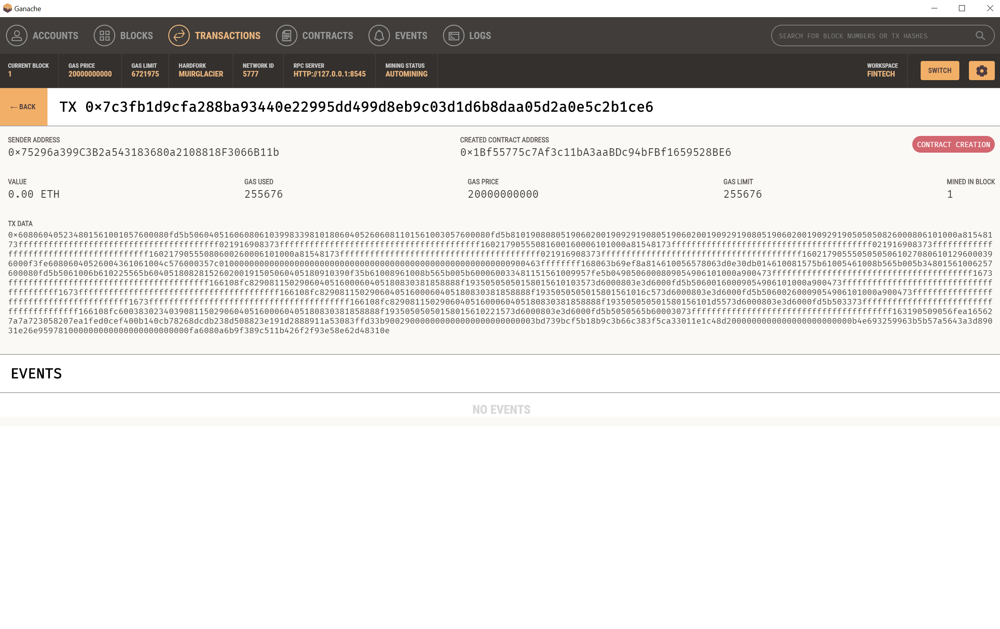
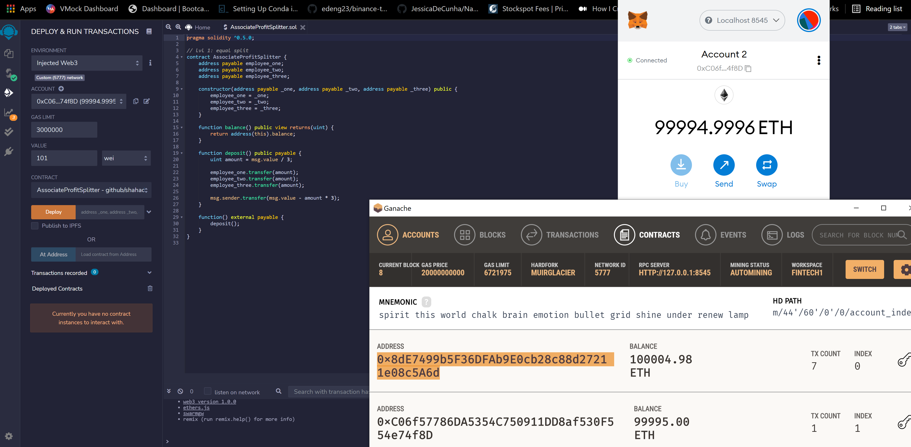
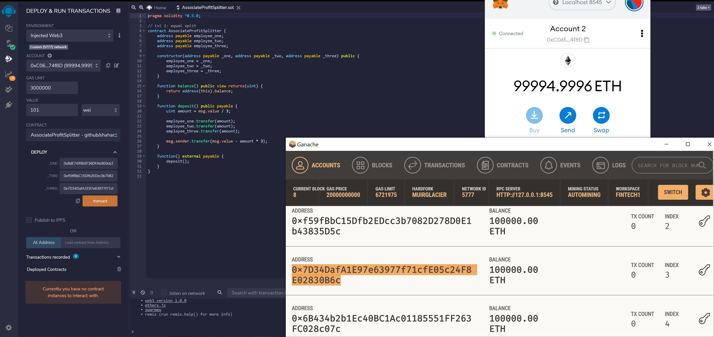

# homework_week20
# TieredProfitSplitter
1. Depositing 100 ETH in metamask 
## 
2. Deploying and confirming transaction 
## 
## 
3. Completed transaction 
## 
4. TX data of block 
## 

---

# AssociateProfitSplitter  
The contract deployed will accept Ether and divide it equally amongst associate-level employees. This will ensure human resources department to pay employees quickly and efficiently. 
1. Contract deployment .sol 
## 
2. Transfer amongst multiple accounts 
## 

